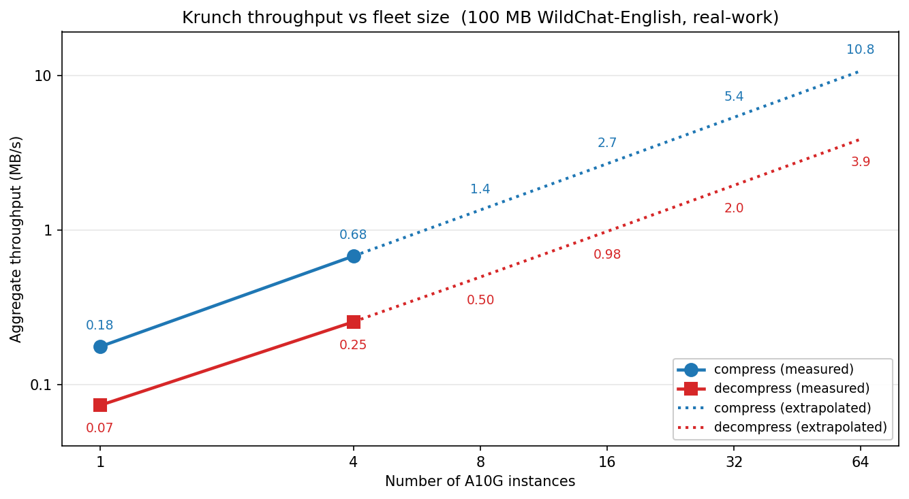

# Krunch

> **Krunch is a neural codec for text.** It works on any NVIDIA GPU
> and beats traditional compression algorithms (like zstd-22) by 20-40%
> on text-heavy data (logs, chat, support tickets, code).
>
> Run it on one machine or parallelize across a cluster with any batch
> system you already use.

## Install + compress

Run on any host with an NVIDIA GPU + Docker:

```bash
# 1. Install (~5-10 min one-time — downloads CLI + pulls 3.5 GB image)
curl -fsSL https://raw.githubusercontent.com/dmatth1/krunch/main/install.sh | sudo bash
# For a pinned, reproducible install:
#   curl -fsSL .../install.sh | sudo KRUNCH_VERSION=v1.0.0 bash

# 2. Use it (instant — image is cached)
krunch compress   data.jsonl  -o data.krunch
krunch decompress data.krunch -o data.jsonl

# Or pipe-style (Unix idiom)
krunch compress   < data.jsonl  > data.krunch
krunch decompress < data.krunch > data.jsonl
```

## Distributed compression

For large files / archival workloads, run krunch as parallel tasks on
whatever batch system you already use. `krunch plan` emits a
ready-to-run artifact for the target you pick.

```bash
# Compress
krunch plan --target aws-batch --mode compress \
    --source s3://… --dest s3://… --workers 16 > compress.json

# Decompress
krunch plan --target aws-batch --mode decompress \
    --source s3://… --dest s3://… --workers 16 > decompress.json

# Planned targets — same flag shape, not yet implemented
krunch plan --target k8s       --mode compress --source … --dest … --workers 16 > job.yaml
krunch plan --target modal     --mode compress --source … --dest … --workers 16 > run.py
krunch plan --target ray       --mode compress --source … --dest … --workers 16 > run.py
krunch plan --target slurm     --mode compress --source … --dest … --workers 16 > run.sbatch
krunch plan --target gcp-batch --mode compress --source … --dest … --workers 16 > job.json
```

Then submit with your own tooling and credentials:
`aws batch submit-job --cli-input-json file://compress.json`,
`kubectl apply -f job.yaml`, `modal run run.py`, etc.

> Only `--target aws-batch` works today; the rest are illustrative of
> the intended UX. Contributions welcome — see
> [CONTRIBUTING.md](CONTRIBUTING.md).

See [`deploy/aws-cdk/`](deploy/aws-cdk/) for a working AWS Batch
reference stack you can `cdk deploy` as-is.

## Throughput

Measured on AWS Batch (A10G g5.xlarge, 100 MB WildChat-English) —
real-work elapsed inside `compress_all` / `decompress_all`, excluding
cold-start container init:



*Note: cold-start tax may increase runtimes on the first job, but
amortizes to zero on warm fleets and on large jobs.*

## Ratio comparisons

Compressed-size ratio (smaller = better) on a single A10G g5.xlarge,
1 MB chunks. Other corpora are pending; ts_zip hasn't been benched
locally yet.

| corpus | krunch | ts_zip | zstd-22 | bzip3 | krunch vs zstd-22 |
|---|---|---|---|---|---|
| WildChat-English (200 MB) | **0.111** | _tbd_ | 0.153 | 0.145 | **−27%** |
| enwik8 | _tbd_ | _tbd_ | _tbd_ | _tbd_ | _tbd_ |
| enwik9 | _tbd_ | _tbd_ | _tbd_ | _tbd_ | _tbd_ |
| nginx logs | _tbd_ | _tbd_ | _tbd_ | _tbd_ | _tbd_ |
| The Stack (Python) | _tbd_ | _tbd_ | _tbd_ | _tbd_ | _tbd_ |

bzip3 at the 1 MB chunked setting is 0.174 — bzip3 wins whole-file but
loses chunked, which is the production regime that lets krunch
parallelize.

## What's inside the Docker image

- **RWKV-4-Pile-169M** pretrained language model (Apache-2.0, BlinkDL) —
  the next-byte predictor.
- **Custom WKV CUDA kernel** — fused recurrence op, ~1000× faster than
  HF transformers' eval-mode fallback.
- **constriction** arithmetic coder — turns the model's
  next-token distribution into a bitstream.

## Adding a new batch target

The artifact `krunch plan` emits contains both the worker tasks (each
computes its byte range from a framework-injected index) and a
finalize task that stitches partial blobs into the final output. The
container contract (`KRUNCH_INPUT_URL`, `KRUNCH_PART_INDEX`,
`KRUNCH_PART_COUNT`, …) is documented and stable — you can wire krunch
into a batch system we don't have a template for in ~30 lines.

## When *not* to use krunch

Krunch is a neural compressor for text. 
If your data isn't text-heavy enough that the language model can
predict it, krunch can produce *larger* output than the input. For
arbitrary binary data, mixed media, or already-compressed payloads, use 
a different compressor.

## Contributing

See [CONTRIBUTING.md](CONTRIBUTING.md).

## License

Apache-2.0. See `NOTICE` for upstream attributions (RWKV-LM, constriction).
